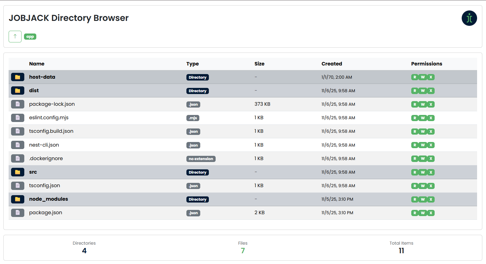
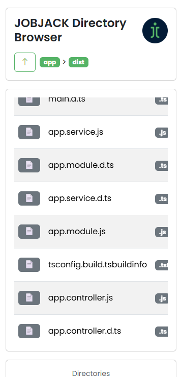

<div align="center">

<h2>JobJack File Explorer</h2>

<p>
  
  
</p>

</div>

A minimal file explorer consisting of an API and a web client, orchestrated with Docker Compose. The API can access a host machine directory via a bind mount and exposes it inside the container at `"/app/host-data"`. The web client talks to the API to browse files.

### Preview

<div align="center">

  <p>
    
  </p>

  <p>
    
  </p>

</div>

### Repository structure

```
.
├─ docker-compose.yml          # Orchestration for API and Web
├─ file-explorer-api/          # API source (Dockerized)
│  └─ Dockerfile
└─ file-explorer-client/       # Web client source (Dockerized)
   └─ Dockerfile
```

### Prerequisites

- Docker Desktop (includes Docker Compose)

### Configure host directory access

The API service bind-mounts a host directory into the container at `"/app/host-data"`. Update the `source` path in `docker-compose.yml` to the host directory you want to expose.

Code reference (edit the `source` only):

```1:15:docker-compose.yml
services:
  api:
    build:
      context: ./file-explorer-api
      dockerfile: Dockerfile
    container_name: jobjack-file-explorer-api
    ports:
      - "3000:3000"
    environment:
      - PORT=3000
    volumes:
      - type: bind
        source: C:/              # ← change this to the desired host path
        target: /app/host-data
```

Notes:
- On Windows, use a drive-qualified path like `C:/data`.
- On macOS/Linux, use a POSIX path like `/Users/you/data` or `/home/you/data`.

### Getting started

1. Update `docker-compose.yml` `source` to the host directory you want the API to expose (see above).
2. Start the stack:
   - Windows PowerShell:

     ```bash
     docker compose up --build -d
     ```

3. Access the apps:
   - Web client: `http://localhost:8080`
   - API: `http://localhost:3000`

Default client view:
- On first load, the web client displays the API container's current working directory.
- To browse files from the host-mounted directory, navigate into `host-data` (or use API requests with `path=host-data/...`).

To stop:

```bash
docker compose down
```

### API: using paths that point to the host directory

Inside the containers, the host directory is available at `"/app/host-data"`. When calling the API, any `path` parameter that should reference the host directory must be prefixed with `"host-data"`, followed by the desired file or folder path (using forward slashes `/`).

Examples (illustrative; replace endpoint names with the ones your API exposes):

- List a directory under the host mount:

  ```bash
  curl "http://localhost:3000/api/list?path=host-data/Users/you/Documents"
  ```


Windows path tip: convert backslashes to forward slashes and omit the drive letter, e.g. `C:\Users\you\Docs\report.txt` becomes `host-data/Users/you/Docs/report.txt`.

### Troubleshooting

- If you get permission errors, ensure Docker Desktop is allowed to share the chosen host directory.
- If the web client cannot reach the API, confirm ports `8080` (web) and `3000` (api) are free and published.
